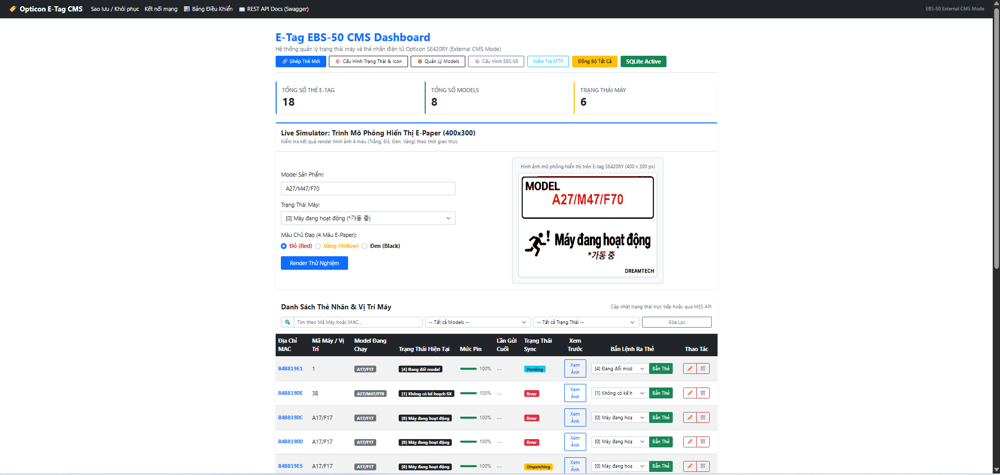
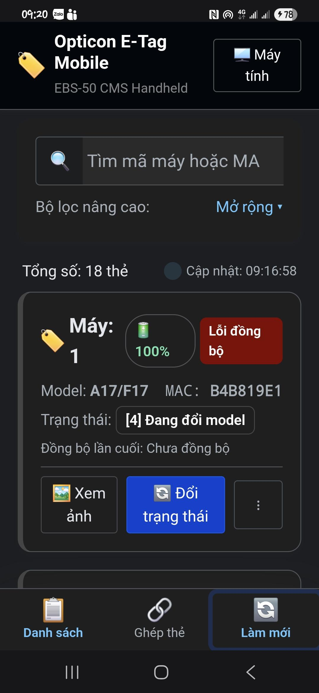
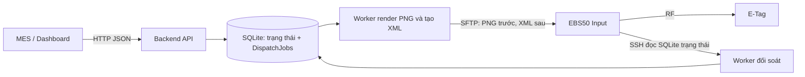

# EBS50 E-Tag Backend

Ứng dụng ASP.NET Core .NET 8 quản lý máy, trạng thái và nhãn điện tử, có Razor Pages, REST API cho MES, SQLite và bộ gửi PNG/XML qua SFTP tới Opticon EBS50.

Đối chiếu: 18/09/2026. Backend dùng Controllers và Swashbuckle; không cần chuyển sang Minimal API để dùng Swagger.

## Desktop dashboard

The desktop dashboard shows tag and model totals, an E-Paper preview, and a tag
list with machine statuses, battery levels, and synchronization statuses.



## Mobile interface

The mobile interface provides tag search and filters, machine details, battery
and synchronization statuses, image previews, and status updates.



## Tài liệu

| Tài liệu | Khi nào đọc |
| --- | --- |
| [Sao lưu / Khôi phục database backend](docs/DATABASE_BACKUP.md) | Export/import SQLite qua web, tạm dừng đồng bộ và phục hồi khi lỗi |
| [Cấu hình EBS50](docs/EBS50_CONFIGURATION.md) | External CMS, tắt Layering, database trên trạm, sao lưu/khôi phục |
| [Tích hợp MES](docs/MES_API_GUIDE.md) | Gọi API, hiểu kết quả và theo dõi cập nhật |
| [Vận hành](docs/OPERATIONS_GUIDE.md) | Publish, Windows Service, log, backup backend và xử lý sự cố |
| [Kiểm chứng và giới hạn](docs/VERIFICATION.md) | Những gì đã thử, chưa thử và các vấn đề cần xử lý tiếp |
| [Kế hoạch triển khai tài liệu](docs/DOCUMENTATION_PLAN.md) | Phạm vi và trạng thái bàn giao |

## Luồng xử lý



HTTP thành công hoặc `Uploaded` chưa xác nhận ảnh trên tag. Ý nghĩa `Confirmed` và giới hạn đối soát được giải thích trong [MES guide](docs/MES_API_GUIDE.md).

## Chạy từ mã nguồn trên Windows

Yêu cầu: .NET 8 SDK, quyền ghi vào thư mục chạy/database/Assets. Khi phát triển có thể tắt riêng EventLog provider nếu tài khoản không có quyền ghi Windows Event Log; console log vẫn hoạt động. Gói publish self-contained mang runtime riêng nên máy đích không cần SDK để chạy.

Mở PowerShell tại thư mục `ebs50_backend`:

```powershell
dotnet restore .\ebs50_backend.csproj
dotnet build .\ebs50_backend.csproj --no-restore
dotnet run --project .\ebs50_backend.csproj --no-launch-profile -- --ServiceSettings:Port=6789 --Logging:EventLog:LogLevel:Default=None
```

Sau startup:

- Dashboard: `http://localhost:6789/`
- Swagger: `http://localhost:6789/swagger`
- OpenAPI JSON: `http://localhost:6789/swagger/v1/swagger.json`

Chọn cổng khác qua `ServiceSettings:Port` nếu cổng đang dùng. Kestrel hiện gọi `ListenAnyIP`, nên đổi `ASPNETCORE_URLS` không phải cách được hướng dẫn để đổi cổng của project.

Database mới được tạo và seed danh mục 0–4 khi khởi động. Nếu tìm thấy `backup_20260915_100710/Input/links.csv` ở thư mục cha, initializer có thể nhập tag/model cũ; không coi database mới là chắc chắn không có tag. Không chạy đồng thời nhiều bản backend trên cùng database/trạm.

Để dùng một database phát triển riêng, truyền đường dẫn tuyệt đối:

```powershell
$devDb = Join-Path $env:TEMP 'ebs50-development.db'
dotnet run --project .\ebs50_backend.csproj --no-launch-profile -- --ServiceSettings:Port=6790 --Logging:EventLog:LogLevel:Default=None "--ConnectionStrings:DefaultConnection=Data Source=$devDb"
```

Đây là database riêng nhưng việc nhập dữ liệu legacy vẫn phụ thuộc ContentRoot. Không trỏ cấu hình thử nghiệm tới trạm thật khi kiểm thử các endpoint thay đổi trạng thái.

## Cấu hình và vị trí dữ liệu

`Program.cs` đổi CurrentDirectory sang `AppContext.BaseDirectory` trước khi tạo host. Với lệnh chạy không launch profile/contentRoot tùy chỉnh, cấu hình và database tương đối thường nằm trong thư mục executable (`bin/Debug/net8.0` khi phát triển). Xem dòng `Content root path` trong console để xác định đúng nơi; đừng sửa nhầm database cùng tên ở gốc source.

| Thành phần | Cách xác định |
| --- | --- |
| Database mặc định | `etag_database.db` dưới AppContext.BaseDirectory; dùng đường dẫn tuyệt đối để chọn khác |
| appsettings | Dưới ContentRoot; môi trường và tham số CLI có thể ghi đè IConfiguration |
| Local_Ebs50_Input | Dưới ContentRoot, chứa bản ảnh/XML gần nhất; lỗi lưu cục bộ chỉ được log warning |
| Assets | Renderer tìm theo ContentRoot, executable và các vị trí fallback trong source; gói triển khai nên chứa Assets cạnh exe |
| wwwroot | Host tìm cạnh executable hoặc fallback thư mục source |
| XML OpenAPI | `ebs50_backend.xml` cạnh assembly; được sinh khi build và mang theo khi publish |

Cấu hình mẫu trong appsettings (thay placeholder):

```json
{
  "ServiceSettings": { "Port": 6789 },
  "ConnectionStrings": { "DefaultConnection": "Data Source=etag_database.db" },
  "Ebs50Settings": {
    "Host": "<EBS50_IP>",
    "Port": 22,
    "Username": "<SSH_USER>",
    "Password": "<SSH_PASSWORD>",
    "RemoteInputPath": "/home/root/ebs_50_run/Input",
    "MinDispatchIntervalSeconds": 20
  }
}
```

**Bảng SystemSettings có thể ghi đè cấu hình file.** Khi lần đầu seed, bảng này đã có thông số kết nối mặc định; chỉ đổi appsettings có thể không đổi được trạm thực sự được sử dụng. Cách quản trị thông thường là lưu cấu hình qua dashboard hoặc `POST /api/Dispatch/config`.

| Thành phần đọc cấu hình | Hành vi hiện tại |
| --- | --- |
| SFTP | IConfiguration trước, SystemSettings sau; host/user/path chỉ ghi đè khi không trắng; port khi parse được; password trong bảng ghi đè cả chuỗi rỗng |
| SSH đọc trạng thái | IConfiguration trước, SystemSettings sau; password rỗng trong bảng không ghi đè fallback; đường dẫn SQLite trạm cố định trong service |
| GET Dispatch/config | Chỉ lấy SystemSettings và fallback trong controller; không hợp nhất appsettings như transport |
| Khoảng cách gửi | MinDispatchIntervalSeconds đọc từ IConfiguration, mặc định 20 giây; không đọc bảng SystemSettings |

Fallback host của SFTP và API cấu hình khác fallback của status service; thiết lập rõ host/port/user/password trong bảng thay vì dựa vào fallback. `Password=null` trong API lưu cấu hình giữ mật khẩu cũ; chuỗi rỗng lưu mật khẩu rỗng. Sự khác nhau của SFTP/SSH khi mật khẩu rỗng được ghi ở [các việc cần xử lý tiếp](docs/VERIFICATION.md).

Hiện API chưa cấu hình xác thực, và GET cấu hình trả mật khẩu không che. Chỉ cấp truy cập trong mạng quản trị phù hợp; không đưa response cấu hình vào log chia sẻ. Việc bổ sung xác thực là thay đổi riêng, chưa được thực hiện trong đợt tài liệu.

## Kiểm tra trước khi gửi

1. Mở dashboard, Swagger và `GET /api/States`.
2. Lưu đúng thông số kết nối rồi gọi Test Connection. Đọc cả `success` và `message`; phép thử này chưa chứng minh quyền ghi hay RF.
3. Cấu hình trạm theo [EBS50_CONFIGURATION.md](docs/EBS50_CONFIGURATION.md).
4. Chọn một tag, kiểm tra model/máy/trạng thái, xem preview rồi gửi thử theo [MES guide](docs/MES_API_GUIDE.md).
5. Đối chiếu log và màn hình tag; không dùng gửi hàng loạt để thử cấu hình mới.

## Cấu trúc chính

```text
Controllers/          REST API
DTOs/                 Request/response contracts
OpenApi/              Metadata Swagger, không đổi runtime formatter
Data/, Models/        EF Core SQLite và entities
Services/Core/        Nghiệp vụ máy/tag
Services/Dispatching/ Queue bền vững, SFTP và đọc trạng thái trạm
Services/Rendering/   Sinh ảnh
Pages/, wwwroot/      Dashboard
Assets/               Font, ảnh, template
scripts/, installer/ Publish và cài Windows Service
docs/                 Hướng dẫn và SQL có điều kiện bảo vệ
```

Hướng dẫn tạo bộ cài, sao lưu khi nâng cấp và quản lý service nằm trong [OPERATIONS_GUIDE.md](docs/OPERATIONS_GUIDE.md).
# Truy cập qua hai mạng

Trang `/Network` hiển thị địa chỉ truy cập và chẩn đoán HTTP/TCP bất đồng bộ.
Xem [hướng dẫn hai mạng](docs/DUAL_NETWORK.md) để cấu hình hai card, firewall, cài service và hoàn tác.
`Install-Service.ps1` hiện cần `-InterfaceAliases` và `-RemoteSubnets` (hai giá trị tương ứng mỗi tham số).
