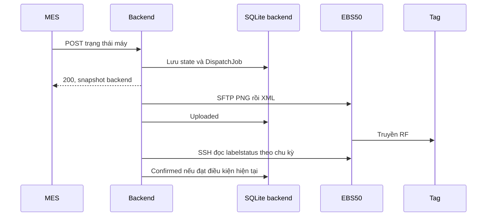

# Hướng Dẫn Vận Hành & Triển Khai Hệ Thống E-Tag EBS-50
*(EBS-50 E-Tag Management & MES Dispatcher Service)*

Đối chiếu: 18/09/2026. [README](../README.md) · [Cấu hình trạm và Layering](EBS50_CONFIGURATION.md) · [MES API](MES_API_GUIDE.md) · [Kết quả kiểm chứng](VERIFICATION.md).

Tài liệu này cung cấp hướng dẫn chi tiết dành cho kỹ sư hệ thống, kỹ thuật viên nhà máy và bộ phận IT vận hành hệ thống quản lý nhãn điện tử Opticon EBS-50 dưới dạng **Windows Service** với cổng dịch vụ mặc định **6789**.

---

## 1. Kiến Trúc Tổng Quan Hệ Thống

```
+-----------------------------+
|    Hệ thống MES Nhà Máy     |
|   (REST API: Cổng 6789)     |
+--------------+--------------+
               | (HTTP JSON)
               v
+-----------------------------------------------------------+
|    PC Trạm / Máy Chủ Windows (Windows Service)            |
|                                                           |
|  [ Web Dashboard: http://localhost:6789 ]                 |
|  [ Inbound Firewall: Port 6789 TCP      ]                 |
|  [ SQLite Database: etag_database.db   ]                 |
|  [ SkiaSharp Rendering Engine (400x300 E-Paper) ]         |
|  [ Transactional Outbox Background Worker      ]         |
+------------------------------+----------------------------+
                               | (SFTP Port 22 / LAN)
                               v
+-----------------------------------------------------------+
|   Trạm Router Phát Sóng Opticon EBS-50 (<EBS50_IP>)    |
|   Thư mục tiếp nhận: /home/root/ebs_50_run/Input/         |
|   Chế độ hoạt động: External CMS Mode                     |
+------------------------------+----------------------------+
                               | (Sóng RF Không Dây)
                               v
+-----------------------------------------------------------+
|   Các Nhãn Điện Tử E-Tag (Màn hình 4.2" SE420RY)          |
|   MAC: B4B819DE, B4B819DA, B4B819E1...                    |
+-----------------------------------------------------------+
```

---

## 2. Các Phương Thức Triển Khai & Cài Đặt

Hệ thống hỗ trợ 2 phương thức cài đặt:

### Phương Thức A: Cài Đặt 1-Click Bằng File Single Installer EXE (Khuyên dùng cho Nhà Máy)

Bộ cài đặt `Ebs50_Setup_v1.0.0.exe` là file thực thi độc lập duy nhất tích hợp sẵn toàn bộ .NET 8.0 Runtime (Self-Contained), các thư viện native (`SkiaSharp`, `SQLite`), tài nguyên web và giao diện đồ họa.

1. **Chuẩn bị:** Sao chép file `Ebs50_Setup_v1.0.0.exe` vào máy trạm Windows cần cài đặt.
2. **Thực thi:** Nhấp đúp chuột vào file `Ebs50_Setup_v1.0.0.exe` (chọn **Yes** khi hộp thoại UAC hỏi cấp quyền Administrator).
3. **Tiến trình cài đặt tự động:**
   - Chọn thư mục cài đặt (mặc định: `C:\Program Files\Ebs50TagManagement`).
   - Bộ cài tự động trích xuất toàn bộ files hệ thống.
   - Tự động đăng ký Windows Service `Ebs50TagService` với chế độ Auto-Start (`start= auto`).
   - Tự động cấu hình chính sách phục hồi lỗi: tự khởi động lại service sau 60 giây nếu bị tắt đột ngột hoặc crash.
   - Tự động mở cổng tường lửa Windows Firewall cho cổng **TCP 6789**.
   - Tự động khởi động dịch vụ và tạo shortcut Start Menu; shortcut Desktop là tùy chọn.
4. **Kiểm tra ngay:** Mở trình duyệt web truy cập `http://localhost:6789`.

---

### Phương Thức B: Cài Đặt Bằng Bộ Script PowerShell Quản Trị (Dành cho IT / DevOps)

Nếu triển khai qua dòng lệnh hoặc môi trường không cài giao diện wizard:

1. Mở **PowerShell với quyền Administrator** (`Run as Administrator`).
2. Di chuyển vào thư mục dự án và chạy script cài đặt:
   ```powershell
   cd 'C:\path\to\e-tag\ebs50_backend\scripts'
   .\Install-Service.ps1
   ```
3. Script sẽ tự động:
   - Dò tìm file thực thi `ebs50_backend.exe`.
   - Dừng và gỡ bản service cũ nếu đã có.
   - Tạo Windows Service `Ebs50TagService`.
   - Cấu hình auto-recovery sau 60 giây (`sc.exe failure ...`).
   - Mở rule tường lửa cổng 6789 (`netsh advfirewall ...`).
   - Khởi động service và in đường dẫn truy cập Dashboard.

---

## 3. Cấu Hình Hệ Thống

### 3.1. Cấu hình IP và Kết Nối Trạm EBS-50
**Bảng SystemSettings có thể ghi đè appsettings.json**, kể cả giá trị được seed lần đầu. Xem bảng thứ tự ưu tiên và khác biệt giữa SFTP/SSH/API cấu hình trong [README](../README.md). GET cấu hình hiện trả mật khẩu không che và API chưa cấu hình authentication; không chia sẻ response này trong log vận hành.

Địa chỉ IP của trạm EBS-50 có thể cấu hình linh hoạt theo 2 cách:
1. **Qua Web Dashboard:** Truy cập `http://localhost:6789` -> Vào mục **Cấu hình Trạm EBS-50** -> Nhập IP trạm (ví dụ `<EBS50_IP>`), Port `22`, User/Password và bấm **Lưu & Kiểm tra kết nối (Test Connection)**.
2. **Qua file cấu hình:** Mở file `appsettings.json` trong thư mục cài đặt:
   ```json
   {
     "ServiceSettings": {
       "Port": 6789
     },
     "Ebs50Settings": {
       "Host": "<EBS50_IP>",
       "Port": 22,
       "Username": "<SSH_USER>",
       "Password": "<SSH_PASSWORD>",
       "RemoteInputPath": "/home/root/ebs_50_run/Input",
       "MinDispatchIntervalSeconds": 20
     }
   }
   ```

### 3.2. Kích hoạt External CMS trên trạm Router EBS-50
Trước khi sử dụng, kiểm tra chế độ nhận ảnh External CMS trên trạm theo [EBS50_CONFIGURATION.md](EBS50_CONFIGURATION.md). Tài liệu cũ tham chiếu `/Database/CMS` và nhãn “Configure external CMS”/“Enable external CMS”; chưa kiểm chứng lại các nút và URL này qua giao diện phiên bản hiện tại. Không đoán giá trị DbFormat để sửa trực tiếp nếu giao diện khác.

Hướng dẫn trạm cũng mô tả quan hệ giữa Layering và schema links, quy trình cho bảng trống, nhánh dừng khi có dữ liệu và cách khôi phục. Không áp dụng SQL của trạm lên database backend.

---

## 4. Quản Trị Dịch Vụ & Giám Sát Nhật Ký (Monitoring & Logs)

### 4.1. Quản lý Trạng Thái Dịch Vụ
- **Khởi động dịch vụ:** `sc.exe start Ebs50TagService` hoặc `Start-Service Ebs50TagService`
- **Dừng dịch vụ (Graceful Shutdown):** `sc.exe stop Ebs50TagService` hoặc `Stop-Service Ebs50TagService`
- **Xem trạng thái:** `sc.exe query Ebs50TagService`
- **Dừng và gỡ cài đặt sạch sẽ:** Chạy script `.\Uninstall-Service.ps1` trong thư mục `scripts/`.

### 4.2. Tra cứu Nhật Ký Lỗi trong Windows Event Viewer
Dịch vụ được tích hợp trực tiếp vào **Windows Event Log** với định danh Source `Ebs50TagService`:
1. Nhấn tổ hợp phím `Win + R`, gõ `eventvwr.msc` và bấm Enter.
2. Mở cây thư mục: **Windows Logs** -> **Application**.
3. Bấm **Filter Current Log...** ở cột bên phải -> Tại ô **Event sources**, chọn hoặc nhập `Ebs50TagService`.
4. Log được ghi theo bộ lọc của EventLog provider. Không thấy Information không đồng nghĩa worker không chạy; xem mục 8 về cấu hình mức log và quyền ghi.

---

## 5. Quy Trình Sao Lưu & Phục Hồi Dữ Liệu (Backup & Restore)

Toàn bộ thông tin liên kết thẻ, danh mục Model, cấu hình trạng thái và lịch sử gửi lệnh được lưu trong CSDL SQLite:
- **Vị trí file CSDL:** `etag_database.db` nằm ngay trong thư mục cài đặt của ứng dụng (ví dụ: `C:\Program Files\Ebs50TagManagement\etag_database.db`).
- **Quy trình sao lưu (Backup):**
  1. Dừng service tạm thời: `sc.exe stop Ebs50TagService`
  2. Đợi service thật sự Stopped, dừng mọi bản console cùng mở database. Nếu còn file `etag_database.db-wal`, không chỉ copy file `.db`: dùng SQLite `.backup` nhất quán hoặc xử lý tiến trình còn giữ DB. Nếu không còn WAL sau shutdown sạch, copy `.db` ra thư mục backup riêng. Sao lưu cả appsettings và Assets tùy biến.
  3. Khởi động lại service: `sc.exe start Ebs50TagService`.
- **Quy trình phục hồi (Restore):**
  1. Dừng service: `sc.exe stop Ebs50TagService`.
  2. Đợi Stopped và đóng mọi kết nối DB. Cất database hiện tại cùng `-wal`/`-shm` nếu có vào thư mục sự cố; không ghép sidecar cũ với backup khác mốc. Khôi phục database, cấu hình và Assets cùng mốc, dùng binary tương thích schema. Kiểm tra quyền file và `PRAGMA integrity_check` bằng công cụ SQLite trước khi start.
  3. Bật lại service: `sc.exe start Ebs50TagService`.

---

## 6. Xử Lý Sự Cố Thường Gặp (Troubleshooting)

| Hiện tượng | Nguyên nhân có thể | Cách khắc phục |
| :--- | :--- | :--- |
| **Không truy cập được Dashboard từ máy khác trong LAN** | Tường lửa chặn cổng 6789 hoặc sai địa chỉ IP máy chủ. | 1. Kiểm tra IP máy chủ bằng lệnh `ipconfig`.<br>2. Kiểm tra rule tường lửa: Chạy lại `netsh advfirewall firewall add rule name="EBS-50 E-Tag Service (Port 6789)" dir=in action=allow protocol=TCP localport=6789 profile=any`. |
| **Thẻ không cập nhật nội dung hiển thị** | Có thể lỗi ở queue, SFTP, xử lý XML/link hoặc RF. | Phân loại theo mục 9; xem log và schema trạm trước khi kết luận do kết nối. |
| **Service báo "Service did not respond in a timely fashion"** | Quá trình khởi tạo DB hoặc kết nối Kestrel bị kẹt. | Kiểm tra quyền ghi database/Assets/EventLog, cổng bị chiếm và log initializer. Service account riêng cần được cấp đúng quyền; LocalSystem không phải yêu cầu bắt buộc. |
| **Ảnh hiển thị trên thẻ bị sai lệch font tiếng Hàn / tiếng Việt** | Thiếu font hỗ trợ hoặc ảnh icon PNG bị hỏng. | Kiểm tra thư mục `Assets/` trong thư mục cài đặt, đảm bảo các file font và icon PNG trạng thái đầy đủ. |

## 7. Build, nâng cấp và kiểm tra bộ cài

Từ thư mục project trên máy có .NET 8 SDK:

```powershell
.\scripts\Publish-App.ps1 -Configuration Release -Runtime win-x64
.\scripts\Build-Installer.ps1
```

Script thứ hai cần Inno Setup theo các đường dẫn tìm trong script. Output publish mặc định `publish/win-x64`, installer ở `dist`. Kiểm tra có exe, native libraries, appsettings, Assets, wwwroot và **ebs50_backend.xml** cạnh binary để Swagger đọc mô tả.

Build-Installer.ps1 tự gọi bước publish; khi cần installer có thể chỉ chạy script thứ hai. Nếu không tìm thấy Inno Setup, script hiện vẫn có thể thoát với mã 0 sau khi publish, nên phải kiểm tra file EXE installer thực sự được tạo.

`Publish-App.ps1` xóa nội dung OutputDir trước build; không chọn thư mục triển khai hoặc nơi giữ dữ liệu làm OutputDir. Nó còn chép database gốc project vào output nếu có: cần kiểm tra database mẫu trước phát hành để không mang theo thông tin kết nối, tag hoặc job từ môi trường khác.

Installer dùng `onlyifdoesntexist` cho database nhưng có thể ghi đè cấu hình và Assets. Sao lưu trước nâng cấp; khoảng chờ cố định của script/installer không bảo đảm shutdown đã hoàn tất. Initializer dùng EnsureCreated và bổ sung schema bằng code, không có quy trình rollback EF migrations tự động.

Quy trình nâng cấp: backup → dừng và xác nhận tiến trình kết thúc → cài binary mới, giữ dữ liệu/cấu hình → start → kiểm tra dashboard/Swagger/preview/kết nối → một tag thử. Nếu rollback, dùng binary tương thích database backup; không giả định binary cũ đọc được mọi schema mới.

`Install-Service.ps1 -Port` chỉ cấu hình rule firewall, mô tả và URL in ra; không sửa cổng Kestrel trong appsettings. Khi đổi cổng phải đồng bộ `ServiceSettings:Port`. Có thể chỉ định exe để tránh cài nhầm bản Debug:

```powershell
.\scripts\Install-Service.ps1 -BinaryPath 'C:\Program Files\Ebs50TagManagement\ebs50_backend.exe' -Port 6789
Get-CimInstance Win32_Service -Filter "Name='Ebs50TagService'" | Select-Object Name, State, StartName, PathName
```

Backup độc lập trước khi gỡ cài đặt. Không dựa vào hộp thoại giữ database của uninstaller thay cho bản sao đã kiểm tra. Khôi phục làm mất thay đổi sau mốc backup.

## 8. Kiểm tra sau triển khai và đọc log

1. Xác định đúng executable, database path và ContentRoot; xem [README](../README.md). Không sửa nhầm file cùng tên ở gốc source.
2. Service Running; dashboard và Swagger truy cập được; GET `/api/States` trả danh mục.
3. Preview/simulate trả PNG với asset/font đúng.
4. Lưu đúng thông số trạm; Test Connection đọc cả success và message. Chức năng hiện chưa thử ghi file; thư mục thiếu vẫn có thể trả success=true kèm message.
5. Cấu hình trạm đúng theo hướng dẫn EBS50, thử một tag, lưu request/log/dữ liệu trạm và ảnh thực tế.

Windows EventLog có bộ lọc riêng. Nếu cần Information và service account có quyền ghi source, cấu hình:

```json
{
  "Logging": {
    "EventLog": { "LogLevel": { "Default": "Information", "Microsoft": "Warning" } }
  }
}
```

Khi phát triển không có quyền Event Log, truyền `--Logging:EventLog:LogLevel:Default=None` như README và đọc console. Đợt kiểm thử tài liệu đã gặp lỗi ghi source và chạy thành công khi tắt provider cho tiến trình thử; chưa kiểm chứng cài source/service bằng Administrator.

```powershell
Get-WinEvent -FilterHashtable @{ LogName='Application'; ProviderName='Ebs50TagService' } -MaxEvents 50 |
    Select-Object TimeCreated, LevelDisplayName, Message
```

Backend có shutdown timeout 30 giây. Khi trạm Linux báo stop timeout, kiểm tra `systemctl show application -p MainPID` và `ps`; không sửa SQLite khi tiến trình vẫn chạy. Các bước và điều kiện tiếp tục nằm trong [hướng dẫn trạm](EBS50_CONFIGURATION.md).

## 9. Truy vết một lần cập nhật và phân loại lỗi



Ghi machineNo, MAC, stateCode, giờ request, JobId (từ send-tag hoặc log/database), revision/binding của job và tên ảnh. HTTP 200/202, file trong Processed, trạm Connected và nội dung trên tag là các bằng chứng khác nhau. Điều kiện Confirmed hiện chưa ràng buộc chặt với revision/ảnh của job mới nhất; xem [MES guide](MES_API_GUIDE.md).

SQL chỉ đọc trên đúng database backend (thay MAC mẫu):

```sql
SELECT MacAddress, MachineNo, CurrentStateCode, SyncStatus,
       DesiredRevision, ConfirmedRevision, LastUploadedAt, LastConfirmedAt
FROM EslTags WHERE MacAddress = 'D0C00001';
SELECT Id, MacAddress, StateCode, Status, AttemptCount, NextAttemptAt,
       LastError, DesiredRevision, BindingVersion, UploadedAt, ConfirmedAt
FROM DispatchJobs WHERE MacAddress = 'D0C00001' ORDER BY CreatedAt DESC LIMIT 10;
```

Trong SSH trên trạm:

```sh
journalctl -u application -n 80 --no-pager -o cat
sqlite3 -readonly /home/root/ebs_50_run/Output/esl.sqlite3 "SELECT MAC,IMAGE_FILE,IMAGE_ID,IMAGE_ID_LOCAL,STATUS,LAST_INFO,LAST_IMAGE FROM labelstatus WHERE MAC='D0C00001';"
sqlite3 -readonly /home/root/ebs_50_run/Output/esl.sqlite3 'SELECT MAC,STATUS,ESLS FROM basestationstatus;'
ls -lt /home/root/ebs_50_run/Input | head
ls -lt /home/root/ebs_50_run/Output/Processed | head
```

| Tầng/hiện tượng | Bằng chứng | Hướng xử lý |
| --- | --- | --- |
| Pending lâu | DispatchJobs, NextAttemptAt, AttemptCount, log worker | Phân biệt cooldown/retry/không có job; không gửi lặp hàng loạt |
| Failed / Error | LastError theo JobId | Sửa lỗi render/kết nối/quyền rồi gửi lại một tag |
| Kết nối được, upload lỗi | Message, quyền ghi Input, dung lượng, log upload | Test Connection chưa thử ghi; kiểm tra lỗi chuyển file thật |
| File đã nhận, lỗi Layer | Log application, schema links, Layering | Quy trình backup và chuyển đổi có bảo vệ trong hướng dẫn trạm |
| Connected nhưng ảnh chưa đổi | ESLS, thông tin liên lạc MAC, pin/RF, image IDs | Connected không chứng minh từng tag online hoặc đã nhận ảnh |
| Ảnh đổi, backend vẫn Uploaded | SSH status service, MAC, đường dẫn SQLite và điều kiện đối soát | So sánh dữ liệu/log; không sửa Confirmed thủ công để che lỗi |
| Confirmed nhưng nội dung cũ | Job/revision, ảnh mong đợi và màn hình thật | Ghi bằng chứng; theo dõi hạn chế ghép revision hiện tại |
| Tên/màu POST không khớp mã | GET lại tag | Navigation property trong response POST có thể cũ |

Đối chiếu `Get-Date -Format o` trên Windows với `date` trên trạm. Ca Layering trước bị lệch tháng; không gộp hai log chỉ theo timestamp. Việc chỉnh giờ/NTP xử lý riêng, không gộp vào đổi schema.

Không mặc định LAST_POLL trống là mất liên lạc; xem ForwardPolls, LAST_INFO và dữ liệu khác. Các mã RF đầy đủ còn cần đối chiếu firmware; tài liệu chỉ mô tả điều kiện mà backend đang dùng.

## 10. Bàn giao

Lưu phiên bản binary, database path, service account/cổng, cấu hình trạm và vị trí backup. Kết quả API/SQL được ghi trong [VERIFICATION.md](VERIFICATION.md); nghiệm thu tag thực tế ghi riêng nếu chưa thực hiện.

Người thay route/DTO cập nhật MES guide; thay firmware/schema cập nhật hướng dẫn trạm; thay installer/script cập nhật tài liệu vận hành trong cùng thay đổi.
